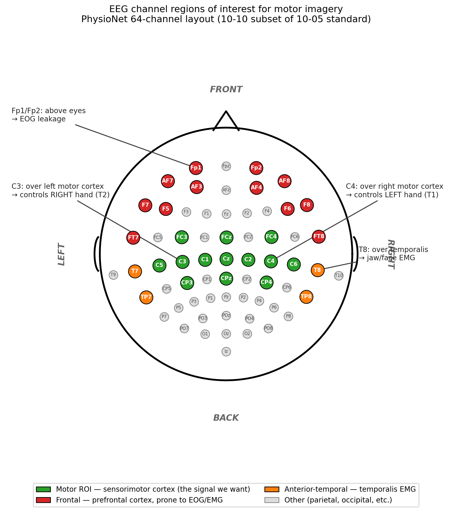

# EEG Motor Imagery Classification — Portfolio Project

End-to-end EEG analysis pipeline for binary motor imagery classification on
the PhysioNet EEGBCI dataset (Schalk et al. 2004). T1 (imagined left fist)
vs T2 (imagined right fist), all 109 subjects, with full preprocessing,
classical ML baselines, and deep learning models — all under honest
cross-subject validation.

**Best result:** ShallowConvNet at 0.802 balanced accuracy (cross-subject,
GroupKFold, 109 subjects). +0.24 over the best classical baseline.

📊 **Interactive dashboard:** [Streamlit app link once deployed]
📓 **Live notebook (Chunk 6, deep learning):** [Kaggle link]

---

## Headline results

Median balanced accuracy across 109 subjects, primary metric throughout:

| Method | Within-subject CV | Cross-subject CV (GroupKFold) |
|---|---|---|
| Random chance | 0.500 | 0.500 |
| Classical CSP + LDA | 0.484 | 0.501 |
| Band power + LinearSVC | 0.574 | 0.555 |
| Lateralization indices + LogReg | 0.580 | 0.560 |
| EEGNet (Lawhern 2018) | 0.570 | 0.758 |
| **ShallowConvNet (Schirrmeister 2017)** | **0.565** | **0.802** |

Within-subject scores cluster around 0.57 — at ~45 trials per subject, no
architecture overcomes the sample-size ceiling. Cross-subject reveals the
deep-learning advantage clearly.

## What's in the repo

```
EEG-MotorImagery/
├── notebooks/
│   ├── 01_data_exploration.ipynb       # PhysioNet dataset structure, single-subject inspection
│   ├── 02_preprocessing.ipynb          # Pipeline: filter → bad channels → ICA → AutoReject
│   ├── 03_erp_tfr_analysis.ipynb       # ERP, mu/beta ERD, cluster permutation tests
│   ├── 04_classical_ml.ipynb           # Lateralization, band power, CSP at single-subject
│   ├── 05_classical_multisubject.ipynb # Same pipeline at population scale (109 subjects)
│   └── 06_deep_learning.ipynb          # EEGNet + ShallowConvNet (runs on Kaggle)
├── src/
│   ├── preprocessing.py     # Composable preprocessing functions
│   ├── features.py          # ERP/TFR utilities + ML feature extraction
│   ├── visualization.py     # Plotting helpers
│   ├── stats.py             # Cluster permutation tests
│   ├── multisubject.py      # Multi-subject orchestration (cache, CV drivers, transformers)
│   ├── eegnetmods.py        # EEGNet + ShallowConvNet PyTorch architectures
│   └── torch_data.py        # Dataset, training loop, sklearn-compatible wrapper
├── dashboard/               # Streamlit app — interactive results explorer
├── docs/
│   └── methodology.md       # Detailed methodology writeup
└── README.md                # this file
```

## Methodology highlights

The methodology is fully documented in
[`docs/methodology.md`](docs/methodology.md). Quick summary:

**Preprocessing (Chunk 2)** — load EDF, standardize channel names with the
standard_1005 montage, notch 60 Hz, bandpass 1–40 Hz, statistical bad-channel
detection (interpolate, don't drop), average reference, Picard ICA with 20
components and Fp1 as pseudo-EOG, epoch −0.5 to +4.0 s around cue, baseline
correct, AutoReject.

**Honest cross-subject validation** — GroupKFold by subject_id, balanced
accuracy as primary metric (4 subjects had ~1.5× class imbalance after
AutoReject), modal sfreq (160 Hz) for population concatenation, interpolated
bads instead of dropped channels (keeps feature dimension constant).

**Pre-registered predictions** — for the deep learning chunk specifically,
predictions were registered in §1 of the notebook before any model was
trained. Three of four resolved as predicted; the one miss (ShallowConvNet
beat EEGNet by 0.044, outside the ±0.03 pre-registered band) produced the
chunk's most interesting finding.

## Key findings

**The within-subject ceiling is sample-size, not architecture.** Classical
features, EEGNet (~2.8K params), and ShallowConvNet (~107K params) all
converge to ~0.57 within-subject. At ~45 trials per subject and ~7 trials in
the inner validation set, early stopping fires on noise. This is a property
of the dataset, not the methods.

**Cross-subject unlocks deep learning's advantage.** With 3,000+ training
trials per fold, both deep architectures cleanly exceed classical baselines.
ShallowConvNet wins because its `temporal conv → spatial conv → square →
log-pool` architecture is the differentiable analog of CSP — and the
log-variance assumption is *correct* for motor imagery (mu/beta band power
desynchronization is the textbook signature).

**Spatial filter analysis reveals *why* ShallowConvNet wins.** Topomap
visualization of cross-subject spatial filters shows:

- **ShallowConvNet's top filters localize to motor cortex** (C3, C1, CP3,
  CP4, FCz, C4 dominating top-3 channels) — the expected anatomy for hand
  motor imagery.
- **EEGNet's top filters concentrate on frontal-channel artifacts** (F8, AF8,
  F7, FT7, AF7) — replicating the same failure mode classical CSP showed in
  Chunk 5 §6 (population-averaged CSP filters localized to Fp1, Fp2, F7, F8,
  T8). Residual EMG/oculomotor activity that survived ICA correlates with
  T1/T2 labels and the network exploits it.

So Shallow's 4-point advantage over EEGNet is a *quality* difference, not
just a numerical one: it's solving the task using the features the protocol
was designed to elicit, while EEGNet is partly exploiting correlated
artifact.



## How to run

**Notebooks 01–05** run locally on CPU. Standard environment:

```bash
git clone https://github.com/Z-bros/EEG-MotorImagery.git
cd EEG-MotorImagery
pip install -r requirements.txt
jupyter notebook notebooks/01_data_exploration.ipynb
```

**Notebook 06 (deep learning)** runs on Kaggle with the free T4 GPU.
Reproduction instructions are in the first cell of the notebook. Local
GPU also works if you adapt the `/kaggle/working/` and `/kaggle/input/`
paths.

**Dashboard:**

```bash
cd dashboard
streamlit run app.py
```

## Stack

MNE-Python (preprocessing, ERP/TFR, topomap visualization),
scikit-learn (classical ML and CV infrastructure),
AutoReject (epoch rejection),
PyTorch (EEGNet, ShallowConvNet),
Streamlit (dashboard).

## What this project does not claim

- Results are good for honest-methodology PhysioNet motor imagery (~0.80
  cross-subject is in the literature range of 0.75–0.90) but well below
  what a deployable BCI needs (~0.95+).
- Papers claiming 95–99% accuracy on this dataset typically use
  trial-randomized splits without subject grouping (leakage), peak-not-mean
  accuracy, cherry-picked responder subsets, or one-vs-rest reframings —
  none of which are methodologically defensible. Our 0.80 is the *honest*
  number.
- The artifact-contamination finding for EEGNet is conditional on this
  dataset and our ICA pipeline. With tighter EMG/oculomotor component
  rejection, EEGNet might localize cleanly.

## License

MIT

## Citation

If this work is useful to you, citation appreciated but not required:

```
Zidane Fatuna (2026). EEG Motor Imagery Classification — Portfolio Project.
GitHub: https://github.com/Z-bros/EEG-MotorImagery
```

Dataset: Schalk, G., et al. (2004). BCI2000: A General-Purpose
Brain-Computer Interface (BCI) System. IEEE TBME 51(6):1034-1043.

## Acknowledgments

- PhysioNet for hosting the EEGBCI dataset
- MNE-Python developers
- Lawhern et al. for EEGNet (2018)
- Schirrmeister et al. for ShallowConvNet (2017)
- Anthropic Claude (Opus 4.7) for code review and methodology discussion
  during portfolio development